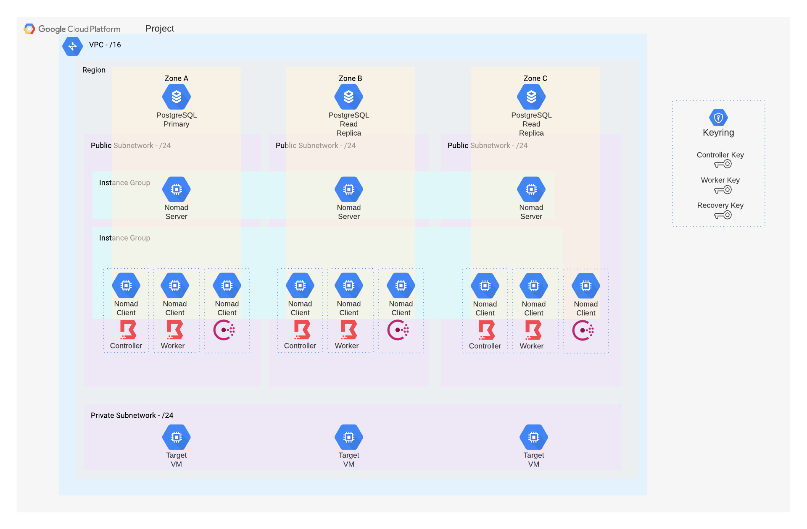

# WIP - Reference Architecture: Boundary on GCP scheduled by Nomad

This reference architecture will run HashiCorp Boundary on GCP, using Nomad to schedule it, Consul connect to facilitate communications between the components and Vault to provide KMS facilities for Boundary. All infrastructure is provisioned with Terraform and VM images built with Packer.

### Below is a working draft architecture diagram:

